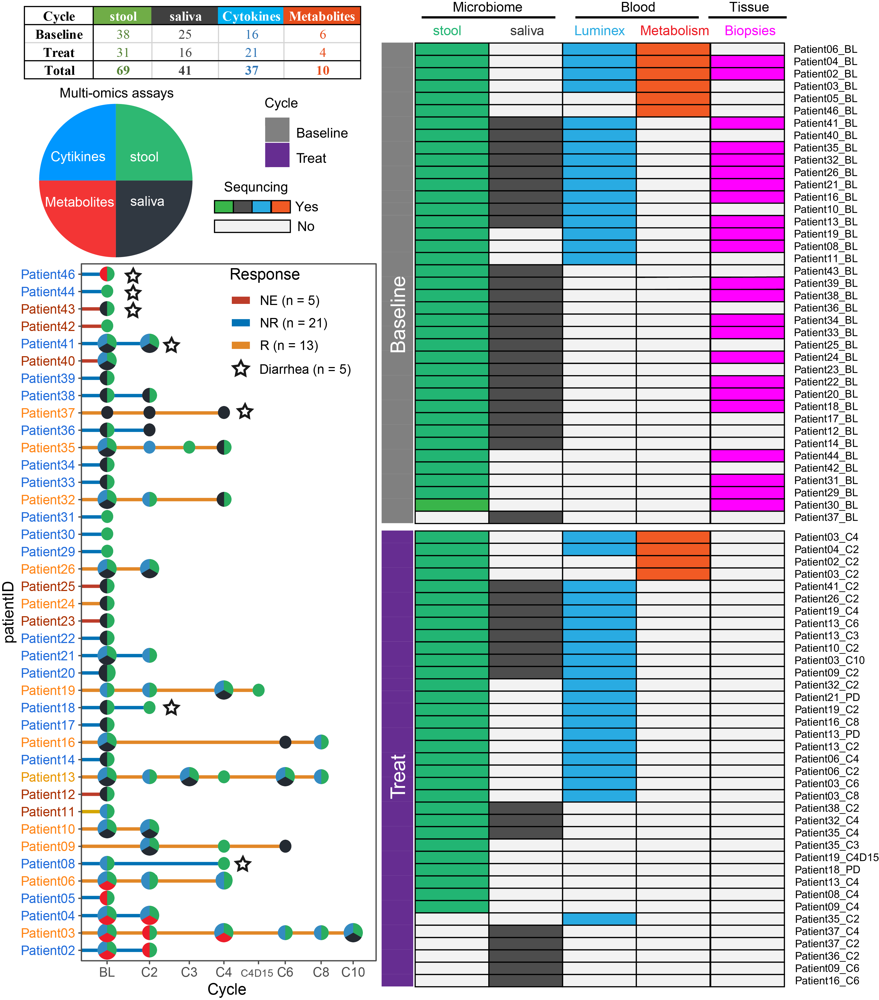

- [1 Requires](#1-requires)
- [2 Samples and Clinical](#2-samples-and-clinical)
  - [2.1 Description](#21-description)
  - [2.2 Clinical](#22-clinical)
  - [2.3 Samples sequending statistics](#23-samples-sequending-statistics)
        statistics](#samples-sequending-statistics)

[`Return`](./)

1 Requires
==========

Requires

    library(tidyverse)
    library(ggthemes)
    library(ggsci)
    library(ggpubr)
    library(survminer)
    library(survival)
    library(survivalROC)
    library(reshape2)
    library(data.table)
    library(ggExtra)
    library(cowplot)
    library(ComplexHeatmap)
    library(scico)
    library(colorspace)
    library(RColorBrewer)
    library(lubridate)
    library(tableone)
    library(kableExtra)
    source("../R_function/colors.R")
    source("../R_function/surv_plot.R")
    theme_set(theme_cowplot())
    "%ni%" <- Negate("%in%")
    options(stringsAsFactors = F)

2 Samples and Clinical
======================

2.1 Description
---------------

<table>
<tr>
<td bgcolor="#AFEEEE">
This is introduction
</td>
</tr>
</table>

2.2 Clinical
------------

<a href="../Data/Data/clinical.csv" target="csv">Clinical.csv</a>

    cli<-fread("../Data/Data/clinical.csv",data.table = F)
    factorvars <- colnames(cli)[-c(1:3,22:25)]
    tableone_groups <- CreateTableOne(vars = colnames(cli)[-c(1:3,22:25)],
                                      strata = 'Response',
                                      data = cli, 
                                      factorVars = factorvars)
    table1_groups <- print(x = tableone_groups, 
                           contDigits = 1,     
                           exact = factorvars, 
                           showAllLevels = FALSE, 
                           noSpaces = TRUE, 
                           printToggle = FALSE) 
    table1_groups %>%
      knitr::kable(caption = "Recreating booktabs style table") 

<table>
<caption>
Recreating booktabs style table
</caption>
<thead>
<tr>
<th style="text-align:left;">
</th>
<th style="text-align:left;">
NE
</th>
<th style="text-align:left;">
NR
</th>
<th style="text-align:left;">
R
</th>
<th style="text-align:left;">
p
</th>
<th style="text-align:left;">
test
</th>
</tr>
</thead>
<tbody>
<tr>
<td style="text-align:left;">
n
</td>
<td style="text-align:left;">
6
</td>
<td style="text-align:left;">
21
</td>
<td style="text-align:left;">
13
</td>
<td style="text-align:left;">
</td>
<td style="text-align:left;">
</td>
</tr>
<tr>
<td style="text-align:left;">
HandFoodSyndrom (%)
</td>
<td style="text-align:left;">
</td>
<td style="text-align:left;">
</td>
<td style="text-align:left;">
</td>
<td style="text-align:left;">
0.347
</td>
<td style="text-align:left;">
exact
</td>
</tr>
<tr>
<td style="text-align:left;">
Level0
</td>
<td style="text-align:left;">
3 (50.0)
</td>
<td style="text-align:left;">
12 (57.1)
</td>
<td style="text-align:left;">
3 (23.1)
</td>
<td style="text-align:left;">
</td>
<td style="text-align:left;">
</td>
</tr>
<tr>
<td style="text-align:left;">
Level1
</td>
<td style="text-align:left;">
1 (16.7)
</td>
<td style="text-align:left;">
3 (14.3)
</td>
<td style="text-align:left;">
2 (15.4)
</td>
<td style="text-align:left;">
</td>
<td style="text-align:left;">
</td>
</tr>
<tr>
<td style="text-align:left;">
Level2
</td>
<td style="text-align:left;">
1 (16.7)
</td>
<td style="text-align:left;">
5 (23.8)
</td>
<td style="text-align:left;">
4 (30.8)
</td>
<td style="text-align:left;">
</td>
<td style="text-align:left;">
</td>
</tr>
<tr>
<td style="text-align:left;">
Level3
</td>
<td style="text-align:left;">
1 (16.7)
</td>
<td style="text-align:left;">
1 (4.8)
</td>
<td style="text-align:left;">
4 (30.8)
</td>
<td style="text-align:left;">
</td>
<td style="text-align:left;">
</td>
</tr>
<tr>
<td style="text-align:left;">
Rash (%)
</td>
<td style="text-align:left;">
</td>
<td style="text-align:left;">
</td>
<td style="text-align:left;">
</td>
<td style="text-align:left;">
0.836
</td>
<td style="text-align:left;">
exact
</td>
</tr>
<tr>
<td style="text-align:left;">
Level0
</td>
<td style="text-align:left;">
5 (83.3)
</td>
<td style="text-align:left;">
13 (61.9)
</td>
<td style="text-align:left;">
9 (69.2)
</td>
<td style="text-align:left;">
</td>
<td style="text-align:left;">
</td>
</tr>
<tr>
<td style="text-align:left;">
Level1
</td>
<td style="text-align:left;">
0 (0.0)
</td>
<td style="text-align:left;">
4 (19.0)
</td>
<td style="text-align:left;">
3 (23.1)
</td>
<td style="text-align:left;">
</td>
<td style="text-align:left;">
</td>
</tr>
<tr>
<td style="text-align:left;">
Level2
</td>
<td style="text-align:left;">
1 (16.7)
</td>
<td style="text-align:left;">
2 (9.5)
</td>
<td style="text-align:left;">
1 (7.7)
</td>
<td style="text-align:left;">
</td>
<td style="text-align:left;">
</td>
</tr>
<tr>
<td style="text-align:left;">
Level3
</td>
<td style="text-align:left;">
0 (0.0)
</td>
<td style="text-align:left;">
2 (9.5)
</td>
<td style="text-align:left;">
0 (0.0)
</td>
<td style="text-align:left;">
</td>
<td style="text-align:left;">
</td>
</tr>
<tr>
<td style="text-align:left;">
Fever (%)
</td>
<td style="text-align:left;">
</td>
<td style="text-align:left;">
</td>
<td style="text-align:left;">
</td>
<td style="text-align:left;">
0.481
</td>
<td style="text-align:left;">
exact
</td>
</tr>
<tr>
<td style="text-align:left;">
Level0
</td>
<td style="text-align:left;">
5 (83.3)
</td>
<td style="text-align:left;">
18 (85.7)
</td>
<td style="text-align:left;">
9 (69.2)
</td>
<td style="text-align:left;">
</td>
<td style="text-align:left;">
</td>
</tr>
<tr>
<td style="text-align:left;">
Level1
</td>
<td style="text-align:left;">
1 (16.7)
</td>
<td style="text-align:left;">
1 (4.8)
</td>
<td style="text-align:left;">
1 (7.7)
</td>
<td style="text-align:left;">
</td>
<td style="text-align:left;">
</td>
</tr>
<tr>
<td style="text-align:left;">
Level2
</td>
<td style="text-align:left;">
0 (0.0)
</td>
<td style="text-align:left;">
2 (9.5)
</td>
<td style="text-align:left;">
3 (23.1)
</td>
<td style="text-align:left;">
</td>
<td style="text-align:left;">
</td>
</tr>
<tr>
<td style="text-align:left;">
Diarrhea (%)
</td>
<td style="text-align:left;">
</td>
<td style="text-align:left;">
</td>
<td style="text-align:left;">
</td>
<td style="text-align:left;">
0.957
</td>
<td style="text-align:left;">
exact
</td>
</tr>
<tr>
<td style="text-align:left;">
Level0
</td>
<td style="text-align:left;">
5 (83.3)
</td>
<td style="text-align:left;">
16 (76.2)
</td>
<td style="text-align:left;">
12 (92.3)
</td>
<td style="text-align:left;">
</td>
<td style="text-align:left;">
</td>
</tr>
<tr>
<td style="text-align:left;">
Level1
</td>
<td style="text-align:left;">
1 (16.7)
</td>
<td style="text-align:left;">
3 (14.3)
</td>
<td style="text-align:left;">
1 (7.7)
</td>
<td style="text-align:left;">
</td>
<td style="text-align:left;">
</td>
</tr>
<tr>
<td style="text-align:left;">
Level2
</td>
<td style="text-align:left;">
0 (0.0)
</td>
<td style="text-align:left;">
1 (4.8)
</td>
<td style="text-align:left;">
0 (0.0)
</td>
<td style="text-align:left;">
</td>
<td style="text-align:left;">
</td>
</tr>
<tr>
<td style="text-align:left;">
Level3
</td>
<td style="text-align:left;">
0 (0.0)
</td>
<td style="text-align:left;">
1 (4.8)
</td>
<td style="text-align:left;">
0 (0.0)
</td>
<td style="text-align:left;">
</td>
<td style="text-align:left;">
</td>
</tr>
<tr>
<td style="text-align:left;">
Gender = Male (%)
</td>
<td style="text-align:left;">
2 (33.3)
</td>
<td style="text-align:left;">
12 (57.1)
</td>
<td style="text-align:left;">
7 (53.8)
</td>
<td style="text-align:left;">
0.623
</td>
<td style="text-align:left;">
exact
</td>
</tr>
<tr>
<td style="text-align:left;">
Age = &gt;60 (%)
</td>
<td style="text-align:left;">
0 (0.0)
</td>
<td style="text-align:left;">
6 (28.6)
</td>
<td style="text-align:left;">
3 (23.1)
</td>
<td style="text-align:left;">
0.505
</td>
<td style="text-align:left;">
exact
</td>
</tr>
<tr>
<td style="text-align:left;">
BMI = &gt;=25 (%)
</td>
<td style="text-align:left;">
2 (33.3)
</td>
<td style="text-align:left;">
7 (33.3)
</td>
<td style="text-align:left;">
2 (15.4)
</td>
<td style="text-align:left;">
0.550
</td>
<td style="text-align:left;">
exact
</td>
</tr>
<tr>
<td style="text-align:left;">
History = yes (%)
</td>
<td style="text-align:left;">
1 (16.7)
</td>
<td style="text-align:left;">
6 (28.6)
</td>
<td style="text-align:left;">
4 (30.8)
</td>
<td style="text-align:left;">
1.000
</td>
<td style="text-align:left;">
exact
</td>
</tr>
<tr>
<td style="text-align:left;">
Smoking = yes (%)
</td>
<td style="text-align:left;">
2 (33.3)
</td>
<td style="text-align:left;">
2 (9.5)
</td>
<td style="text-align:left;">
2 (15.4)
</td>
<td style="text-align:left;">
0.265
</td>
<td style="text-align:left;">
exact
</td>
</tr>
<tr>
<td style="text-align:left;">
Dringking = yes (%)
</td>
<td style="text-align:left;">
2 (33.3)
</td>
<td style="text-align:left;">
1 (4.8)
</td>
<td style="text-align:left;">
2 (15.4)
</td>
<td style="text-align:left;">
0.154
</td>
<td style="text-align:left;">
exact
</td>
</tr>
<tr>
<td style="text-align:left;">
anitEGFR = yes (%)
</td>
<td style="text-align:left;">
2 (33.3)
</td>
<td style="text-align:left;">
5 (23.8)
</td>
<td style="text-align:left;">
5 (38.5)
</td>
<td style="text-align:left;">
0.642
</td>
<td style="text-align:left;">
exact
</td>
</tr>
<tr>
<td style="text-align:left;">
antiVEGF = yes (%)
</td>
<td style="text-align:left;">
3 (50.0)
</td>
<td style="text-align:left;">
13 (61.9)
</td>
<td style="text-align:left;">
7 (53.8)
</td>
<td style="text-align:left;">
0.829
</td>
<td style="text-align:left;">
exact
</td>
</tr>
<tr>
<td style="text-align:left;">
LiverM = yes (%)
</td>
<td style="text-align:left;">
5 (83.3)
</td>
<td style="text-align:left;">
14 (66.7)
</td>
<td style="text-align:left;">
9 (69.2)
</td>
<td style="text-align:left;">
0.896
</td>
<td style="text-align:left;">
exact
</td>
</tr>
<tr>
<td style="text-align:left;">
LungM = yes (%)
</td>
<td style="text-align:left;">
5 (83.3)
</td>
<td style="text-align:left;">
10 (47.6)
</td>
<td style="text-align:left;">
9 (69.2)
</td>
<td style="text-align:left;">
0.248
</td>
<td style="text-align:left;">
exact
</td>
</tr>
<tr>
<td style="text-align:left;">
LymphM = yes (%)
</td>
<td style="text-align:left;">
2 (33.3)
</td>
<td style="text-align:left;">
10 (47.6)
</td>
<td style="text-align:left;">
6 (46.2)
</td>
<td style="text-align:left;">
0.911
</td>
<td style="text-align:left;">
exact
</td>
</tr>
<tr>
<td style="text-align:left;">
PeritonealM = yes (%)
</td>
<td style="text-align:left;">
0 (0.0)
</td>
<td style="text-align:left;">
8 (38.1)
</td>
<td style="text-align:left;">
2 (15.4)
</td>
<td style="text-align:left;">
0.142
</td>
<td style="text-align:left;">
exact
</td>
</tr>
<tr>
<td style="text-align:left;">
OtherM = yes (%)
</td>
<td style="text-align:left;">
1 (16.7)
</td>
<td style="text-align:left;">
5 (23.8)
</td>
<td style="text-align:left;">
0 (0.0)
</td>
<td style="text-align:left;">
0.162
</td>
<td style="text-align:left;">
exact
</td>
</tr>
<tr>
<td style="text-align:left;">
Location = right (%)
</td>
<td style="text-align:left;">
3 (50.0)
</td>
<td style="text-align:left;">
6 (28.6)
</td>
<td style="text-align:left;">
4 (30.8)
</td>
<td style="text-align:left;">
0.590
</td>
<td style="text-align:left;">
exact
</td>
</tr>
</tbody>
</table>

2.3 Samples sequending statistics
---------------------------------

    data<-fread("../Data/Data/samples_seqInfo.csv",data.table = F)
    

